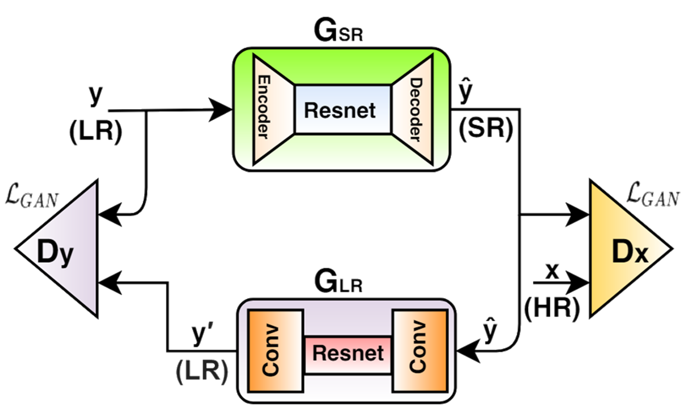
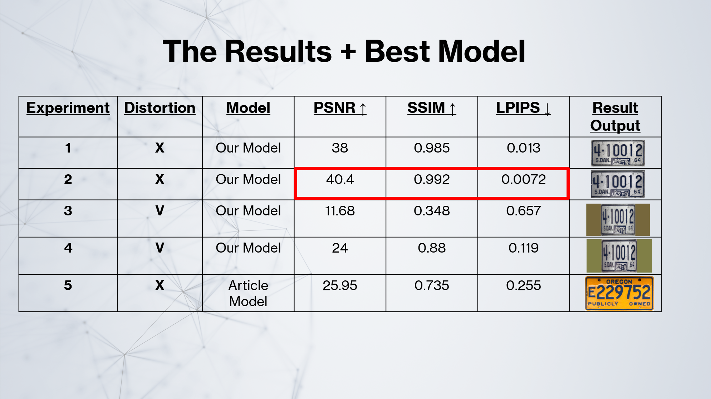
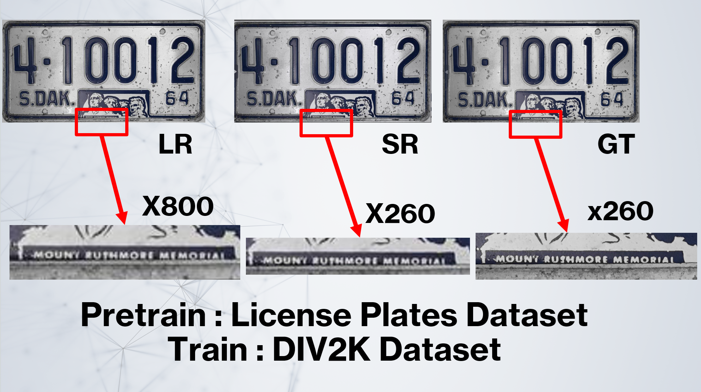
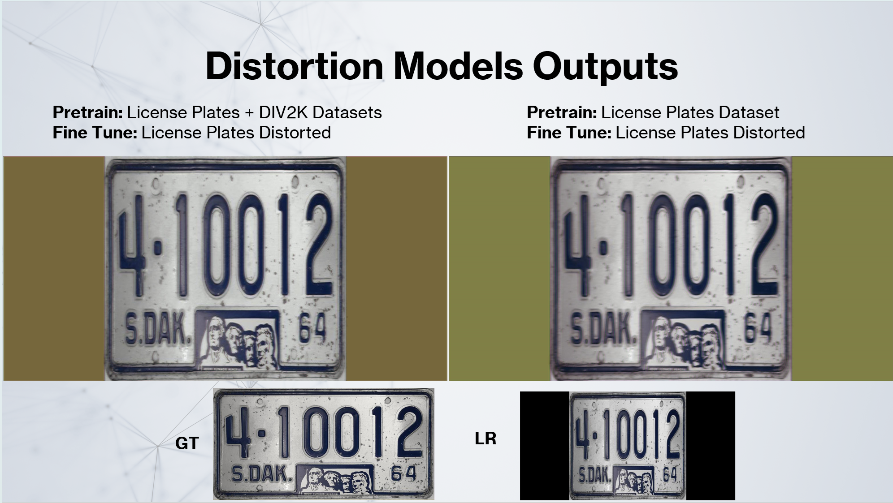

# SRResCycGAN

A pytorch implementation of the SRResCycGAN network according to the paper: [Deep Cyclic Generative Adversarial Residual Convolutional Networks for Real Image Super-Resolution]([url](https://arxiv.org/abs/2009.03693))

## General Information
The Article Name: Deep Cyclic Generative Adversarial Residual Convolutional Networks for Real Image Super-Resolution

As a part of our academic research for our MSc degree, we researched and developed a model to perform Super Resolution tasks and attempted to use the developed model to fix distortion of rotated license plates as well as performing the super resolution task. 
Our project was focused on using Generative Adversarial Network (GAN) to perform these tasks. 
The project had two parts, a "dry" part where the primary research and planning was made, this part was more theoretical. The second part was the "wet" part where the development process and the experiments were done. 
You can find the powerpoint presentations that conclude both parts in the [Presentations](Presentations) folder in this repository. 
(If the presentations do not load up after downloading them separately, please download the whole repository and they should load up).

In our experiment process we ran training of the article's code taken from the official Git (link below) and compared the results with the results of our trained model. 
Article code Git: https://github.com/RaoUmer/SRResCycGAN?tab=readme-ov-file

The development of the model was done using google colab and the notebooks can be found in the [Notebooks](Notebooks) folder in this repository. 
Please note that the model is big and requires many resources to run the training as it is configured in the notebooks. We used colab pro+ in order to run the training of the model on the A100 GPU. 

We also added an src folder with adaptations to the code for anyone who wishes to use it in other environments.

## Model Training
The license plates dataset we used was found on Kaggle and cleaned in the process of the experiments. The model had the best performance for super resolution when the training was done on 750 images from the dataset with a resolution of 2K and above. 
We also trained the model on the DIV2K dataset using the weights of the best model we managed to receive from the training process on the high resolution license plates dataset. 
The training on the DIV2K dataset was done to see if training on more generic images will improve the model's performance when performing Super Resolution tasks on license plates images. 

The license plates dataset was later used to create a dataset of distorted images where the license plates were rotated on the y axis at a random angle between 30 to 70 degrees. 
After creating the new dataset, we used it to train the model using the weights of the model trained only on the license plates and the weights of the model trained with both license plates dataset and DIV2K dataset to see if any yields a better result.
Both models did not produce good results on the distortion part but performed well for the super resolution task.

## Datasets
License Plates Dataset: https://www.kaggle.com/datasets/tolgadincer/us-license-plates 
DIV2K Dataset: https://www.kaggle.com/datasets/soumikrakshit/div2k-high-resolution-images

## Model General Architecture

## The Experiments
### Experiment 1
Training on 750 images of license plates without any distortion and without using a pre-trained dataset.

### Experiment 2
Training on 800 images from the DIV2K dataset without any distortion, using a pre-trained model based on license plates.

### Experiment 3
Training on 750 distorted images of license plates (dimensional distortion) using a pre-trained model based on license plates.

### Experiment 4
Trained on 750 distorted images of license plates  (dimensional distortion) using a pre-trained model based on both license plates and the DIV2K dataset.

### Experiment 5
Training the model from the Article on 500 images of license plates without any distortion, according to the setting described in the article

## Quantitative Results
In the image below you can find the results according to the metrics of PSNR, SSIM and LPIPS. We strive to get high PSNR and SSIM values and low LPIPS values. 
The best results are shown in the red rectangle and dismplay great values for each metric.

## Visual Results
### Super Resolution task
In the image below you can find the results for the Super Resolution task performed by our developed model after training it on the License plates dataset using 750 images with a resolution of 2K and above + DIV2K dataset with 800 images for training.

### Distortion Fix Task
In the image below you can find the results for the attempted fix of the rotated license plate image + the super resolution task. We can see that the super resolution task was done successfully but sadly, the model did not fix the distortion. 

